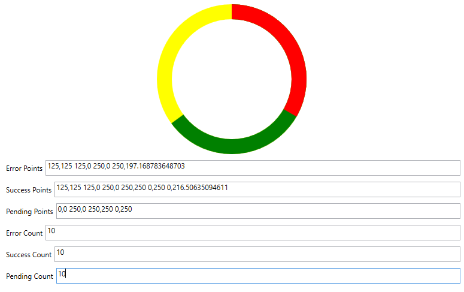

# WPF Doughnut ProgressBar or Status Indicator

This code is an example to anyone that needs it.

I needed to figure out how to replicate the GitHub Pull Request status circle in WPF.

I did read this [stackoverflow: WPF Doughnut ProgressBar](https://stackoverflow.com/questions/36752183/wpf-doughnut-progressbar). It was food for thought but I took a different approach.

I realized I could compute a polygon to convey the progress and apply a mask on top.

I started here by writing the code to create a polygon.

Then using clipping and overlaying the polygons was able to create this.

